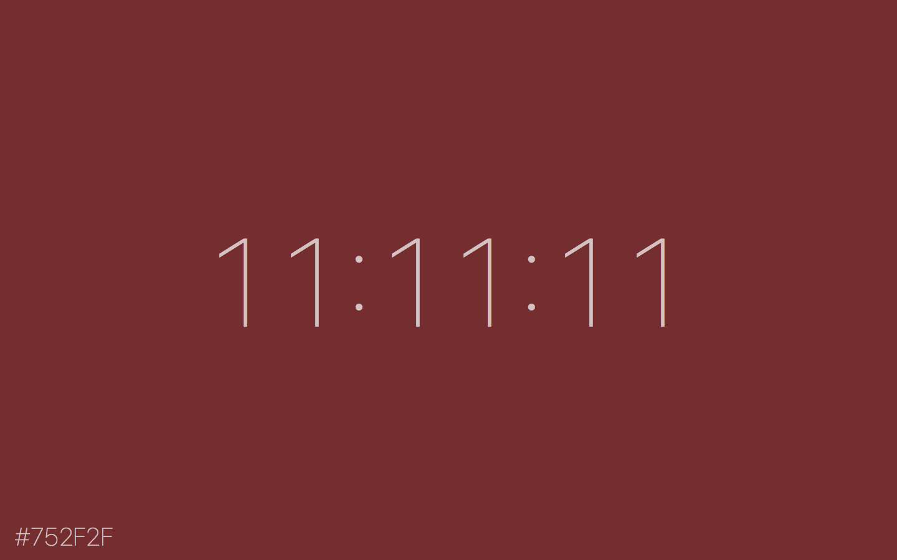

# Night Shade

> A tiny color clock screen saver for macOS

Night Shade is a macOS screen saver that converts the current time to an RGB hex
code. It’s heavily inspired by Jack Hughes’s
[The Colour Clock](http://thecolourclock.co.uk). Unlike The Colour Clock, which
requires Flash, Night Shade has no dependencies.

## Installation

1. Make sure System Preferences is not running
2. Download `NightShade.saver.zip` from
[the latest GitHub release](https://github.com/realm/SwiftLint/releases/latest) and unzip it
3. Open `Night Shade.saver` (by double-clicking it), which will open System Preferences
4. Choose whether to install Night Shade for just the current user, or for all users on your computer

You can now delete both `NightShade.saver.zip` and `Night Shade.saver`, if you like.

## Uninstallation

1. Open System Preferences, and navigate to Desktop & Screen Saver
2. Right click (or control-click) on Night Shade, and select
`Delete “Night Shade”`

## License

[MIT licensed](LICENSE.md), © 2018 Erik Strottmann.
